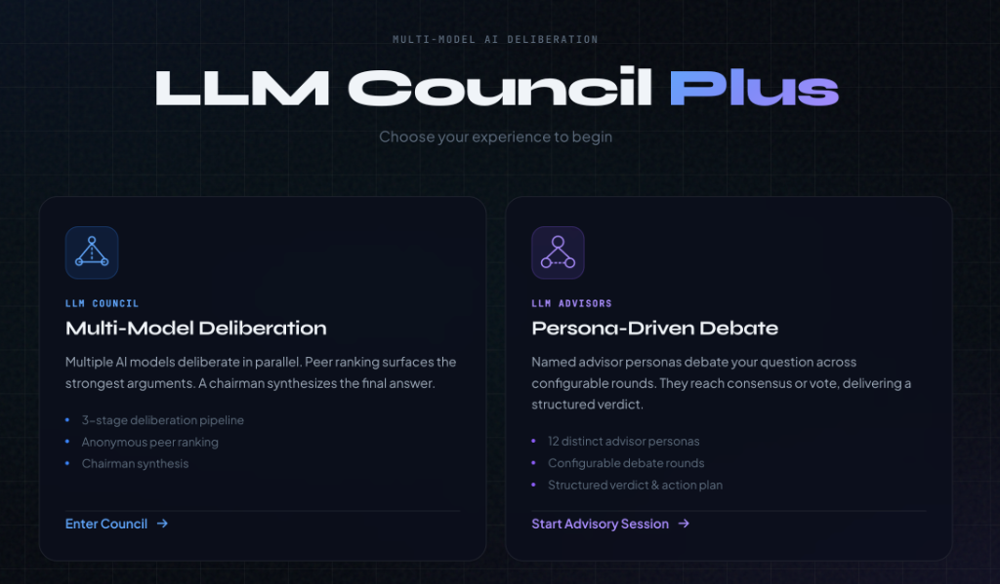

# The AI Counsel

> **Collective AI Intelligence** — Convene a council of AI models that deliberate, peer-review, and synthesize the best answer — or assemble a panel of named advisor personas that debate your question and deliver a structured verdict.

[](https://www.python.org/downloads/)
[](https://reactjs.org/)
[](https://fastapi.tiangolo.com/)
[](https://opensource.org/licenses/MIT)

<p align="center">
  
</p>

---

## What is The AI Counsel?

The AI Counsel is a **dual-mode multi-model AI deliberation system**. Instead of relying on a single LLM for answers, it orchestrates multiple models working together — either through anonymous peer review or persona-driven debate.

**Choose your experience:**

- **🏛️ LLM Council** — Multiple AI models independently answer your question, anonymously peer-review each other's responses, and a chairman model synthesizes the collective wisdom into a final answer.
- **🎭 LLM Advisors** — Named advisor personas (The Skeptic, The Strategist, The Ethicist, etc.) debate your question across configurable rounds, reaching consensus or voting to deliver a structured verdict with an action plan.

<p align="center">
  <div align="center">
    <a href="https://www.youtube.com/watch?v=HOdyIyccOCE" target="_blank">
      
    </a>
    <a href="https://www.youtube.com/watch?v=NUmQFGAwD3g" target="_blank">
      
    </a>
  </div>
</p>

---

## Installation

```bash
# Clone and install
git clone https://github.com/jacob-bd/the-ai-counsel.git
cd the-ai-counsel
uv sync                        # Backend dependencies
npm install --prefix frontend  # Frontend dependencies

# Run (from project root)
./start.sh
```

Then open **http://localhost:5173** and configure your API keys in Settings.

> **Prerequisites:** Python 3.10+, Node.js 18+, [uv](https://docs.astral.sh/uv/)

---

## Two Modes of Deliberation

### 🏛️ LLM Council — Multi-Model Deliberation

The original three-stage pipeline where raw model diversity produces vetted answers:

```
YOUR QUESTION (+ optional web search)
         │
         ▼
  ┌─────────────────────────────────┐
  │   STAGE 1: DELIBERATION         │
  │   Claude, GPT-4, Gemini, Llama  │
  │   Each answers independently    │
  └──────────────┬──────────────────┘
                 ▼
  ┌─────────────────────────────────┐
  │   STAGE 2: PEER REVIEW          │
  │   Anonymized as A, B, C, D      │
  │   Each model ranks all others   │
  └──────────────┬──────────────────┘
                 ▼
  ┌─────────────────────────────────┐
  │   STAGE 3: CHAIRMAN SYNTHESIS   │
  │   Reviews all + rankings        │
  │   Delivers the final answer     │
  └─────────────────────────────────┘
```

**Execution modes** control deliberation depth:

| Mode | Stages | Best For |
|------|--------|----------|
| **Chat Only** | Stage 1 only | Quick responses, comparing model outputs |
| **Chat + Ranking** | Stages 1 & 2 | Peer review without synthesis |
| **Full Deliberation** | All 3 stages | Complete council synthesis (default) |

### 🎭 LLM Advisors — Persona-Driven Debate

A fundamentally different approach: named personas with distinct thinking styles argue your question in structured rounds.

```
YOUR QUESTION (+ optional web search)
         │
         ▼
  ┌─────────────────────────────────┐
  │   ROUND 1: OPENING POSITIONS    │
  │   Each advisor states their case │
  └──────────────┬──────────────────┘
                 ▼
  ┌─────────────────────────────────┐
  │   ROUND 2–N: DEBATE             │
  │   Rotating order, respond to    │
  │   each other by name            │
  │   (auto-stops on consensus)     │
  └──────────────┬──────────────────┘
                 ▼
  ┌─────────────────────────────────┐
  │   VERDICT (or TIEBREAKER)       │
  │   Summary, consensus points,    │
  │   disagreements table, verdict, │
  │   next steps, open questions    │
  └─────────────────────────────────┘
```

**10 built-in advisor personas:**

| Persona | Role | Style |
|---------|------|-------|
| 🔍 **The Skeptic** | Critical Thinker | Challenges assumptions, demands evidence |
| 🔧 **The Pragmatist** | Practical Advisor | Focuses on feasibility and real-world constraints |
| 💡 **The Innovator** | Creative Thinker | Pushes boundaries, explores unconventional solutions |
| 📜 **The Historian** | Pattern Analyst | Draws lessons from historical patterns |
| ⚖️ **The Ethicist** | Moral Compass | Examines decisions through ethics and fairness |
| 📊 **The Data Analyst** | Evidence Evaluator | Brings quantitative rigor and measurable evidence |
| 🎭 **The Contrarian** | Devil's Advocate | Deliberately argues the opposing position |
| ♟️ **The Strategist** | Big-Picture Thinker | Thinks long-term about positioning and leverage |
| 🤝 **The Humanist** | People-First Advocate | Centers the human experience and well-being |
| 🛡️ **The Risk Assessor** | Risk Analyst | Identifies worst-case scenarios and mitigations |

All personas are **fully customizable** — edit name, role, description, system prompt, and emoji. Changes persist across sessions with per-persona reset to defaults.

---

## Features

### Multi-Provider Support

Mix and match models from 10 different provider types:

| Provider | Type | Description |
|----------|------|-------------|
| **OpenRouter** | Cloud | 100+ models via single API (GPT-4, Claude, Gemini, Mistral, etc.) |
| **Ollama** | Local | Run open-source models locally (Llama, Mistral, Phi, etc.) |
| **Groq** | Cloud | Ultra-fast inference for Llama and Mixtral models |
| **NVIDIA NIM** | Cloud | NVIDIA Build models via `integrate.api.nvidia.com` |
| **OpenAI Direct** | Cloud | Direct connection to OpenAI API |
| **Anthropic Direct** | Cloud | Direct connection to Anthropic API |
| **Google Direct** | Cloud | Direct connection to Google AI API |
| **Mistral Direct** | Cloud | Direct connection to Mistral API |
| **DeepSeek Direct** | Cloud | Direct connection to DeepSeek API |
| **Custom Endpoint** | Any | Any OpenAI-compatible API (Together AI, Fireworks, vLLM, LM Studio, GitHub Models, etc.) |

### Web Search Integration

Ground your council's or advisors' responses in real-time information:

| Provider | Type | Notes |
|----------|------|-------|
| **DuckDuckGo** | Free | Hybrid web+news search, no API key needed |
| **TinyFish** | Free | Batch Fetch API for fast multi-URL fetching |
| **Serper** | API Key | Real Google results, 2,500 free queries |
| **Tavily** | API Key | Purpose-built for LLMs, rich content |
| **Brave Search** | API Key | Privacy-focused, 2,000 free queries/month |

**Full Article Fetching**: Uses [Jina Reader](https://jina.ai/reader) to extract full article content from top search results (configurable 0–10 results).

### Temperature Controls

Fine-tune creativity vs consistency per stage:

- **Council Heat**: Stage 1 response creativity (default: 0.5)
- **Chairman Heat**: Final synthesis creativity (default: 0.4)
- **Stage 2 Heat**: Peer ranking consistency (default: 0.3)

### Additional Features

- **Live Progress Tracking** — See each model or advisor respond in real-time with streaming
- **Multi-turn Conversations** — Follow-up questions carry full context automatically
- **Council Sizing** — Adjust council from 1 to 8 models; advisors from 2 to 4 personas
- **Advisor Presets** — Save and load named advisor lineups (personas, model mode, optional rounds/web search) from Advisor Setup
- **Abort Anytime** — Cancel in-progress requests
- **Conversation History** — All conversations saved locally with search
- **Customizable System Prompts** — Edit Stage 1, 2, and 3 prompts for Council mode
- **Rate Limit Warnings** — Alerts when your config may hit API limits
- **"I'm Feeling Lucky"** — Randomize your council composition
- **Import & Export** — Backup and share your settings, API keys, and prompts
- **Per-request Model Overrides** — Use different models for individual requests without changing global config
- **One-shot API** — `POST /api/ask` for scripts and MCP agents (no conversation state)
- **Docker Deployment** — Single-container production deployment via `docker compose`

---

## Quick Start

### Prerequisites

- **Python 3.10+**
- **Node.js 18+**
- **[uv](https://docs.astral.sh/uv/)** (Python package manager)

### Running the Application

**Option 1: Use the start script (recommended)**
```bash
./start.sh
```

**Option 2: Run manually**

Terminal 1 (Backend):
```bash
uv run python -m backend.main
```

Terminal 2 (Frontend):
```bash
cd frontend
npm run dev
```

Then open **http://localhost:5173** in your browser.

### Docker / VPS Deployment

```bash
docker compose up -d --build
```

Then open **http://YOUR_SERVER_IP:8001**. Conversations and settings persist to `./data` automatically.

For Ollama integration, reverse proxy setup, environment variables, and upgrade instructions, see **[docs/DOCKER.md](docs/DOCKER.md)**.

### Network Access

The start script exposes both frontend and backend on the network automatically:

- **Local:** `http://localhost:5173`
- **Network:** `http://YOUR_IP:5173`

For manual setup:
```bash
# Backend with network access
LLM_COUNCIL_BIND_HOST=0.0.0.0 uv run python -m backend.main

# Frontend with network access
cd frontend && npm run dev -- --host
```

Remote admin endpoints (`/api/settings/export`, `/api/settings/import`, `/api/settings/reset`) require `LLM_COUNCIL_ADMIN_TOKEN` when accessed by proxied or remote clients.

---

## Configuration

### First-Time Setup

On first launch, configure at least one LLM provider in Settings:

1. **LLM API Keys** — Enter API keys for your chosen providers (and Ollama URL / custom endpoint if used)
2. **Council Config** (Settings) or **welcome-screen Council Setup** — add members and chairman; both edit the same saved lineup
3. **Save Changes** (Settings only — welcome screen auto-saves)

API keys **auto-save** when you click "Test" and the connection succeeds.

**Provider toggles vs Advisors:** Settings → Council Config **Remote/Local toggles** filter which sources appear in **council** model pickers only. **LLM Advisors** use every configured provider (saved API keys + Ollama URL + custom endpoint) regardless of those toggles.

**Advisor presets:** In Advisor Setup, save named lineups (personas, models, optional rounds/web search) from the Model Assignment section. Presets persist in `settings.json` as `advisor_presets` (max 20; one default).

### LLM API Keys

| Provider | Get API Key |
|----------|-------------|
| OpenRouter | [openrouter.ai/keys](https://openrouter.ai/keys) |
| Groq | [console.groq.com/keys](https://console.groq.com/keys) |
| NVIDIA | [build.nvidia.com](https://build.nvidia.com/) |
| OpenAI | [platform.openai.com/api-keys](https://platform.openai.com/api-keys) |
| Anthropic | [console.anthropic.com](https://console.anthropic.com/) |
| Google AI | [aistudio.google.com/apikey](https://aistudio.google.com/apikey) |
| Mistral | [console.mistral.ai/api-keys](https://console.mistral.ai/api-keys/) |
| DeepSeek | [platform.deepseek.com](https://platform.deepseek.com/) |

### Ollama (Local Models)

1. Install [Ollama](https://ollama.com/)
2. Pull models: `ollama pull llama3.1`
3. Start Ollama: `ollama serve`
4. In Settings, enter your Ollama URL (default: `http://localhost:11434`)
5. Click "Connect" to verify

### Custom OpenAI-Compatible Endpoint

Connect to any OpenAI-compatible API:

1. Go to **LLM API Keys** → **Custom OpenAI-Compatible Endpoint**
2. Enter **Display Name**, **Base URL**, and **API Key** (optional for local servers)
3. Click "Connect" to test and save

**Compatible services**: Together AI, Fireworks AI, vLLM, LM Studio, GitHub Models, and more.

---

## MCP Server

The AI Counsel exposes a powerful Model Context Protocol (MCP) server that lets AI tools like Claude Code and Gemini CLI interact directly with your local or remote instance.

The server exposes **10 action-based tools** grouped by domain:
1. **Deliberation**: `council_deliberate` (stage1/stage2/stage3/full), `model_chat` (quick/multi_turn), `advisor_debate`, `run_iterative_debate`
2. **Configuration**: `council_settings`, `advisor_settings`, `personas`, `providers`, `config_backup`
3. **History**: `conversations` (list/get)

Legacy 25-tool names were removed in v0.5.2. `run_iterative_debate` was added in v0.7.0. See [docs/mcp/TOOLS.md](docs/mcp/TOOLS.md) for the action parameter on each tool.

**Quick registration for Claude Code:**

* **Option A: Local stdio (Standard for local development)**
  ```bash
  pip install -e .
  claude mcp add llm-council python -m the_ai_counsel_mcp
  ```

* **Option B: Remote SSE (Zero-install for containers/servers)**
  ```bash
  claude mcp add llm-council --url http://yourserver.com:8001/mcp/sse
  ```

Then ask Claude: "check the council health" to verify the connection (`providers` → action `health`; expect 10 tools in `/api/health`).

See **[docs/mcp/](docs/mcp/)** for full setup guides, including stdio/SSE transport configurations, complete tools reference, and usage examples.

---

## Claude Code Skill (REST fallback)

When MCP isn't available or you need preset CRUD / raw SSE, install the **`the-ai-counsel-api` skill**. When **both** skill and MCP are present, agents should **use MCP tools first** — the skill documents REST as fallback.

```bash
# Symlink from your cloned repo
mkdir -p ~/.claude/skills
ln -s "$(pwd)/skills/the-ai-counsel-api" ~/.claude/skills/the-ai-counsel-api
```

The skill covers all API endpoints, SSE stream parsing, advisor endpoints, and troubleshooting. See [`skills/the-ai-counsel-api/SKILL.md`](skills/the-ai-counsel-api/SKILL.md) for the full reference.

Contributors: keep REST API, MCP tools, skill, and user docs in sync — see [`docs/DOC-SYNC.md`](docs/DOC-SYNC.md).

---

## Tech Stack

| Component | Technology |
|-----------|------------|
| **Backend** | FastAPI, Python 3.10+, httpx (async HTTP) |
| **Frontend** | React 19, Vite, react-markdown |
| **Styling** | CSS with "Midnight Glass" dark theme |
| **Storage** | JSON files in `data/` directory |
| **Package Management** | uv (Python), npm (JavaScript) |

---

## Data Storage

All data is stored locally in the `data/` directory:

```
data/
├── settings.json              # Configuration (includes API keys)
├── persona_overrides.json     # Advisor persona customizations
└── conversations/             # Conversation history
    ├── {uuid}.json
    └── ...
```

**Privacy**: No data is sent to external servers except API calls to your configured LLM providers.

> **⚠️ Security Warning: API Keys Stored in Plain Text**
>
> API keys are stored in clear text in `data/settings.json`. The `data/` folder is included in `.gitignore` by default.
>
> - **Do NOT remove `data/` from `.gitignore`**
> - Never commit `data/settings.json` to version control
> - If you accidentally expose your keys, rotate them immediately

---

## Troubleshooting

**"Failed to load conversations"**
- Backend might still be starting up — the app retries automatically

**Models not appearing in dropdown**
- **Council (Settings → Council Config):** Ensure the provider toggle is enabled for that source
- **Advisors (Advisor Setup):** Toggles do not apply — configure API keys / Ollama URL / custom endpoint under **LLM API Keys** instead
- Check that API key is configured and tested successfully
- For Ollama, verify connection is active

**Jina Reader returns 451 errors**
- HTTP 451 = site blocks AI scrapers (common with news sites)
- Try Tavily/Brave instead, or set `full_content_results` to 0

**Rate limit errors (OpenRouter)**
- Free models: 20 requests/min, 50/day
- Consider using Groq (14,400/day) or Ollama (unlimited)

**Binary compatibility errors (node_modules)**
- When syncing between Intel/Apple Silicon Macs:
  ```bash
  rm -rf frontend/node_modules && npm install --prefix frontend
  ```

**Logs:**
- Backend: Terminal running `uv run python -m backend.main`
- Frontend: Browser DevTools console

---

## Credits & Acknowledgements

This project builds upon the original **[llm-council](https://github.com/karpathy/llm-council)** by **[Andrej Karpathy](https://github.com/karpathy)**.

**The AI Counsel** extends that foundation with dual-mode deliberation (Council + Advisors), 10 provider integrations (including NVIDIA NIM), web search, persona-driven debates, customizable prompts, an MCP server, Docker deployment, and much more.

We gratefully acknowledge Andrej Karpathy for the original inspiration and codebase.

---

## License

MIT License — see [LICENSE](LICENSE) for details.

---

## Contributing

Contributions are welcome! This project embraces the spirit of "vibe coding" — feel free to fork and make it your own.

---

<p align="center">
  <strong>Built with the collective wisdom of AI</strong><br>
  <em>Ask the council. Debate with advisors. Get better answers.</em>
</p>
